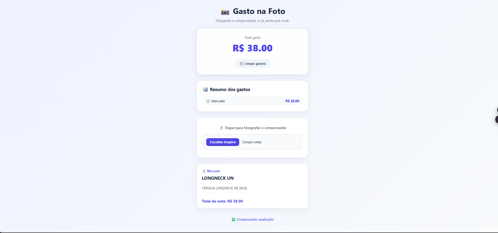

# 📸 Gasto na Foto



> Uma aplicação web que utiliza Inteligência Artificial para analisar comprovantes de compras e organizar gastos automaticamente.

## 🧠 Sobre o projeto

O **Gasto na Foto** é uma aplicação web desenvolvida para facilitar a organização de gastos.

A proposta é simples: o usuário seleciona ou fotografa um comprovante de compra e a Inteligência Artificial analisa a imagem, identificando informações importantes da compra.

A aplicação então organiza os dados e apresenta os gastos de forma visual.

## ✨ Funcionalidades

- 📸 Upload de comprovantes
- 🤖 Análise de imagens com Inteligência Artificial
- 🏪 Identificação do estabelecimento
- 🛒 Identificação dos produtos
- 🏷️ Classificação dos gastos por categoria
- 💰 Identificação do valor total
- 📊 Resumo dos gastos por categoria
- 💵 Cálculo do total geral
- 🗑️ Limpeza dos gastos
- 📱 Interface responsiva
- ⏳ Feedback durante o processamento da IA

## 🤖 Como funciona

O funcionamento da aplicação segue este fluxo:

```text
📸 Comprovante
      ↓
🤖 Inteligência Artificial
      ↓
🔎 Análise das informações
      ↓
🏪 Estabelecimento
🛒 Produtos
🏷️ Categoria
💰 Valor
      ↓
📊 Organização dos gastos
      ↓
💵 Total geral